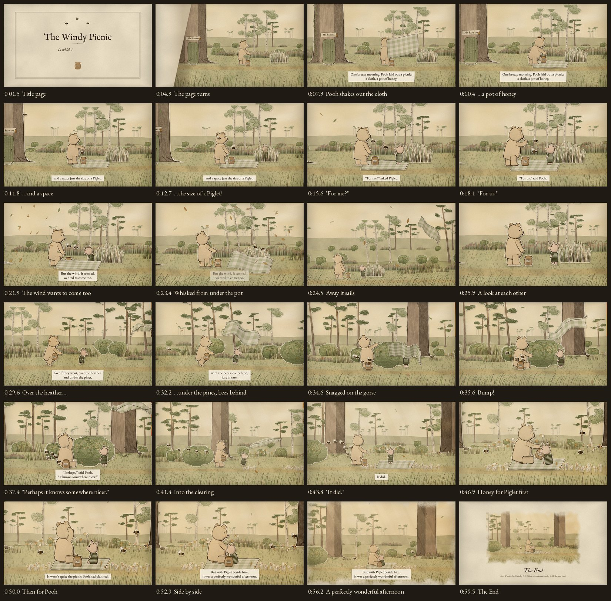

# Storyboard

Frames taken from the finished film. See [script.md](script.md) for the full shot list with narration.

The vertical (9:16) film, reframed shot by shot for phones: [storyboard-vertical.jpg](storyboard-vertical.jpg).

| Time | Beat | Camera |
|------|------|--------|
| 0:00–0:04 | The title page inks itself in; the narrator reads the chapter heading. | Static page |
| 0:04–0:05 | The page turns. | Page curl reveals the Forest |
| 0:05–0:14 | Pooh shakes out the cloth, sets down the HUNNY pot and presents "a space just the size of a Piglet". Piglet pops up on cue. | Slow push-in from a wide shot of Mr Sanders' door |
| 0:14–0:19 | "For me?" / "For us." Piglet's happy hop. | Two-shot |
| 0:19–0:23 | The wind rises: a leaf, leaning grass, fluttering ears, a lifting corner. | Slight pull-back |
| 0:23–0:25 | The gust pulls the cloth out from under the pot, and it sails away over Piglet. | Whip up and right with the cloth |
| 0:25–0:27 | A look at the pot, then at each other. Pooh scoops it up, Piglet points, and they're off. | Cut to a close two-shot |
| 0:27–0:34 | The chase over the heather and under the pines. Piglet leaps and misses, and the bees follow the honey. | Tracking shot with bracken sweeping past in the foreground |
| 0:34–0:39 | Snagged on the gorse. Pooh reaches on tiptoe, it pops free, bump! Then "Perhaps it knows somewhere nicer." | Settles, then closer on Pooh thinking |
| 0:39–0:45 | Into the sunlit clearing; the cloth floats down and lies flat. "It did." | Pan through the trees, then closer |
| 0:45–0:51 | Sharing the honey from the pot between them: Piglet first, then Pooh. | Cut to a close two-shot, slow push |
| 0:51–0:57 | Piglet leans on Pooh; the light turns golden. | Long pull-back, keeping the pair above the subtitles |
| 0:56–1:00 | The picture settles onto the page as a printed plate. *The End.* | Scene shrinks into the book |
